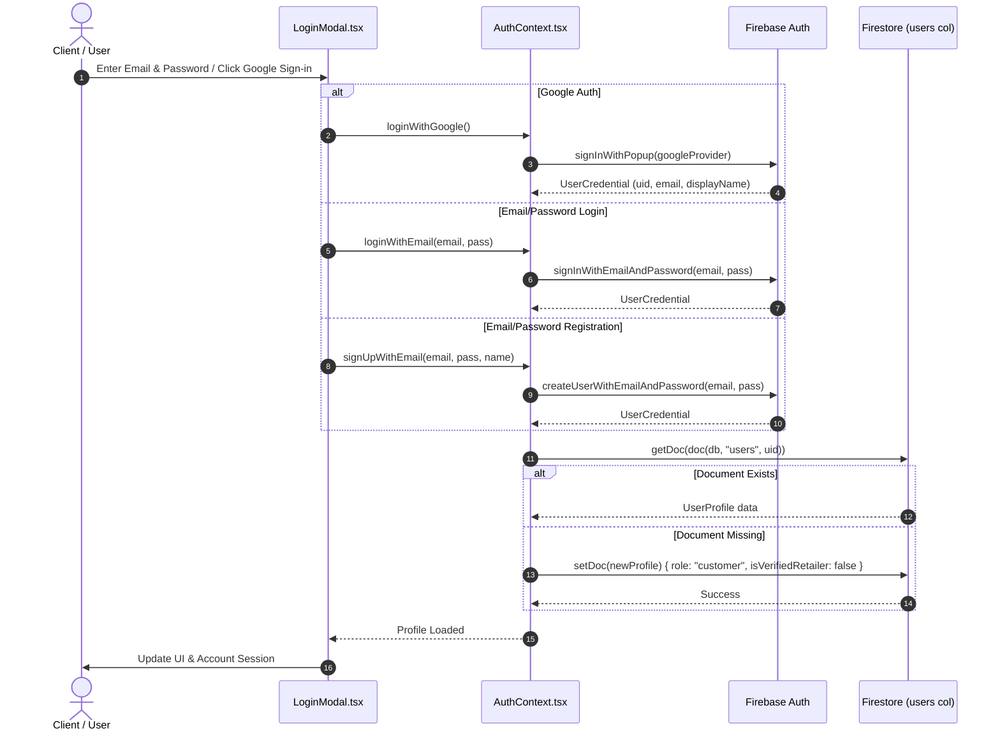
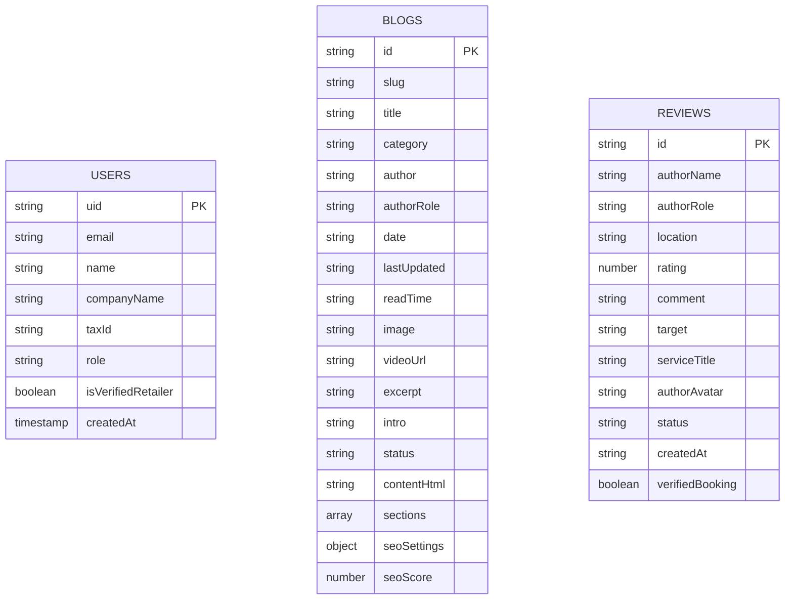
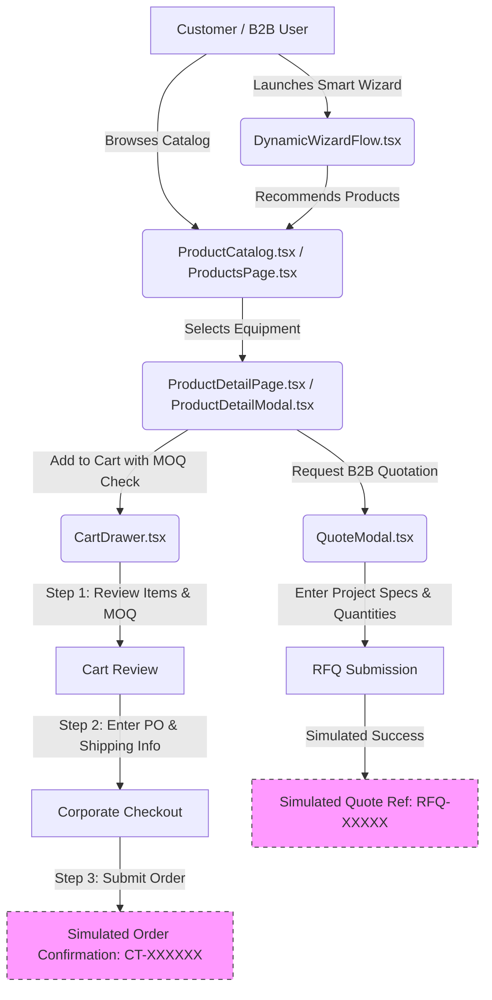

# Project Architecture — Cool Technologies B2B E-Commerce & HVAC Platform

> **Document Status**: Production Architecture Phase Completed  
> **Audited Date**: 2026-08-26  
> **Audited Codebase**: Cool Technologies (`cool-technologies (3)`)  
> **Architectural Completion Estimate**: ~85% Functional Complete (Production-grade persistent Firestore Data Layer, B2B Order Requests, RFQs, RBAC, Admin Operational Suite, and SEO Engines fully integrated).

---

## 1. Project Overview

### 1.1 What the Current Application Does
Cool Technologies is a specialized B2B e-commerce platform and HVAC technical service management web application targeting the United Arab Emirates (UAE) and wider Gulf Cooperation Council (GCC) commercial cooling market. 

The application serves dual purposes:
1. **B2B Equipment Catalog & Sourcing**: Wholesale commercial cooling equipment (Split ACs, Chillers, AHUs, Compressors, Coils, Pipes, Controls) with wholesale inquiry/quote workflows, multi-tier pricing, and visual smart equipment selection wizards.
2. **Technical Services & Facility Maintenance**: Commercial HVAC maintenance service booking, chemical cleaning, duct fabrication, chiller overhauls, PPM contracts, and customer review publishing.

### 1.2 Current Implemented Modules
- **Public Showcase & Discovery**: Responsive Homepage, Mega-Menu Header with live debounced search, Hero with quote lead capture, Value ribbons, Categories showcase, Brand partners, Achievements, About pages, Management profile, Careers listing, Media center, Contact center.
- **Product Catalog & Sourcing**: Filterable catalog by category and search keyword, Product detail views with technical specifications, OEM model numbers, tropical ambient ratings, and MOQ validation. Real-time sync with Firestore `products` collection.
- **Persistent B2B Order Requests**: Cart drawer checkout connects to Firestore `orders` and `companies` collections, generating unique `OT-YYYY-XXXXXX` references with complete customer and line-item snapshots.
- **Persistent Quotation Requests (RFQ)**: Project quote modal and hero lead capture persist to Firestore `rfqs` and `companies` collections with unique `RFQ-YYYY-XXXXXX` references.
- **Role-Based Access Control (RBAC)**: Integrated Firebase Auth with Firestore `users` profiles supporting roles (`admin`, `superAdmin`, `sales`, `retailer`, `customer`) with automatic discount rates (10% for verified retailers).
- **Admin Management Portal**: Complete enterprise back-office with tabs for:
  - **B2B Order Requests**: Pipeline management, status progression (`NEW`, `UNDER_REVIEW`, `CONTACTED`, `QUOTED`, `CONFIRMED`, `COMPLETED`, `CANCELLED`), internal MEP engineering notes, and audit history.
  - **Commercial RFQs**: Tonnage estimation, proposal bid price tracking, and estimator assignment.
  - **Corporate Accounts & TRNs**: Registered B2B companies, UAE TRN tax IDs, and wholesale tier management.
  - **Products & Catalog**: CRUD, hide price toggle, bulk Excel/CSV import.
  - **Services**: Full service contracts management.
  - **Blog Hub**: Technical content creation and SEO schema publishing.
  - **Customer Reviews**: Approval/moderation workflow with Firestore sync.
  - **Smart Selection Wizard Builder**: Interactive node-based flowchart canvas (`@xyflow/react`).
  - **User Directory & RBAC**: Real-time Firestore user permissions.
  - **Technical SEO Suite**: 40+ point audit, OpenGraph, JSON-LD schemas, and XML Sitemap generator.

### 1.4 Current Technology Stack
| Layer | Technology | Purpose / Notes |
| :--- | :--- | :--- |
| **Framework** | React 19 (`19.0.1`) + React DOM | Modern UI library with StrictMode enabled |
| **Language** | TypeScript (`~5.8.2`) | Strict typing across components, models, and services |
| **Build Tool & Server** | Vite 6 (`6.2.3`) | ES module bundler, development server on port 3000 |
| **Styling** | Tailwind CSS v4 (`@tailwindcss/vite` 4.1.14) | Utility-first styling with `@theme` token customizations in `src/index.css` |
| **Icons** | `lucide-react` (`^0.546.0`) | Comprehensive icon library |
| **Mindmap / Flowcharts** | `@xyflow/react` (`^12.11.3`) | Interactive node-based flowchart canvas for selection wizards |
| **Animation** | `motion` (`^12.23.24`) | Micro-interactions and transition animations |
| **Authentication** | Firebase Auth (`^12.17.1`) | Email/Password and Google OAuth popup providers |
| **Primary Database** | Cloud Firestore (`firebase/firestore`) | Real-time document store for `users`, `blogs`, `reviews` |
| **Alternative DB Skeleton** | Cloudflare D1 (`src/services/cloudflareD1.ts`) | Prepared REST API queries for SQLite tables (inactive in UI) |
| **AI Integration** | `@google/genai` (`^2.4.0`) | Installed dependency and `.env.example` placeholder |

---

## 2. Complete Directory Structure

```
cool-technologies/
├── .DS_Store
├── .env.example
├── .gitignore
├── metadata.json
├── index.html
├── package.json
├── package-lock.json
├── tsconfig.json
├── vite.config.ts
├── untitled.tsx
├── README.md
├── public/
│   ├── robots.txt
│   ├── sitemap.xml
│   └── whatsapp-official.png
├── assets/
│   └── .aistudio/
└── src/
    ├── main.tsx                          # Application entry point & AuthProvider wrapper
    ├── App.tsx                           # Master application controller, routing, and state hub
    ├── index.css                         # Tailwind v4 theme definitions and font imports
    ├── types.ts                          # Core data interfaces (Product, Workflow, BlogPost, etc.)
    ├── data.ts                           # Static categories, brands, default services
    ├── assets/
    │   └── images/                       # Local HVAC product, facility, and branding images
    │       ├── Cool Technologies Logo.png
    │       ├── cool_tech_hq_1784538496855.jpg
    │       ├── hvac_air_conditioner_1784350824930.jpg
    │       ├── hvac_chiller_1784350873395.jpg
    │       ├── hvac_coils_1784350888537.jpg
    │       ├── hvac_compressor_1784350840924.jpg
    │       ├── hvac_pipes_1784350907486.jpg
    │       └── hvac_thermostat_1784350856402.jpg
    ├── components/
    │   ├── AboutModal.tsx                # Quick about popup dialog
    │   ├── AboutPage.tsx                 # Full company overview and technical credentials
    │   ├── AboutShort.tsx                # Homepage mini about teaser
    │   ├── Achievements.tsx              # Enterprise statistics and metrics section
    │   ├── BlogPage.tsx                  # Public blog directory & individual article reader
    │   ├── Brands.tsx                    # OEM brand showcase carousel
    │   ├── CareersPage.tsx               # Employment and engineering job postings
    │   ├── CartDrawer.tsx                # Flyout slide-over cart & corporate checkout wizard
    │   ├── Categories.tsx                # Homepage category grid
    │   ├── ContactForm.tsx               # Embedded technical support inquiry form
    │   ├── ContactPage.tsx               # Full contact center page with location maps
    │   ├── CustomerReviews.tsx           # Homepage customer review grid & rating overview
    │   ├── Features.tsx                  # Value proposition ribbon
    │   ├── Footer.tsx                    # Global site footer with deep navigation links
    │   ├── Header.tsx                    # Sticky header with mega menu, search, account actions
    │   ├── Hero.tsx                      # Hero banner with dynamic RFQ lead capture
    │   ├── LoginModal.tsx                # Customer / Retailer sign-in and registration dialog
    │   ├── ManagementModal.tsx           # Leadership team popup modal
    │   ├── ManagementPage.tsx            # Full corporate management and executive profiles
    │   ├── MediaPage.tsx                 # Press releases, media coverage, and downloads
    │   ├── ProductCatalog.tsx            # Homepage product listing with filtering
    │   ├── ProductDetailModal.tsx        # Quick-view product popup modal
    │   ├── ProductDetailPage.tsx        # Dedicated full-page product specification view
    │   ├── ProductsPage.tsx              # Comprehensive catalog page with advanced filtering
    │   ├── QuoteModal.tsx                # B2B quotation request dialog (RFQ)
    │   ├── ServicesPage.tsx              # HVAC technical engineering services showcase
    │   ├── SubmitReviewPage.tsx          # Standalone public client review submission portal
    │   ├── account/
    │   │   ├── RetailerOnboardingModal.tsx # B2B trade account verification form
    │   │   └── UserProfileModal.tsx      # Personal account profile editor
    │   ├── admin/
    │   │   ├── AdminBlogManager.tsx      # Blog list, search, status filter, bulk delete
    │   │   ├── AdminLoginScreen.tsx      # Standalone admin authentication screen
    │   │   ├── AdminPanelPage.tsx        # Master admin dashboard container and navigation tabs
    │   │   ├── AdminReviewManager.tsx    # Customer reviews moderation & approval hub
    │   │   ├── AdminSeoSuite.tsx         # SEO tag manager, sitemaps, and 301 redirects
    │   │   ├── AdminUserManagement.tsx   # Customer & retailer user directory management
    │   │   ├── BlogPostEditorModal.tsx   # Multi-tab visual blog and SEO metadata editor modal
    │   │   ├── BlogPostEditorPage.tsx    # Standalone full-screen blog authoring page
    │   │   ├── ExcelProductImporterModal.tsx # Bulk product import from spreadsheet data
    │   │   ├── MindMapCanvas.tsx         # Node-based visual decision tree canvas (`@xyflow/react`)
    │   │   ├── ProductEditorModal.tsx    # Product creation and modification form
    │   │   ├── SalesBuilderPage.tsx      # Dedicated sales team flowchart workflow builder
    │   │   ├── ServiceEditorModal.tsx    # Technical service creation/editor form
    │   │   └── SmartSelectionBuilder.tsx # Flowchart step list & mindmap controller
    │   ├── common/
    │   │   ├── FloatingWidgets.tsx       # WhatsApp floating chat, social bar, trust badge
    │   │   └── SEOHead.tsx               # Dynamic metadata, canonical, OpenGraph, JSON-LD
    │   └── selection-wizard/
    │       ├── DynamicWizardFlow.tsx     # Step-by-step interactive decision runner
    │       ├── FloatingSelectorTrigger.tsx # Floating trigger button for selection wizard
    │       └── SelectionWizardModal.tsx  # Modal container for equipment selection wizard
    ├── context/
    │   └── AuthContext.tsx               # Firebase Auth state provider and user profile syncing
    ├── data/
    │   ├── allProductsData.ts            # Large static dataset of OEM HVAC products (~13k lines)
    │   ├── importedProducts.ts           # Sample imported product specifications
    │   ├── initialBlogs.ts               # Default seed blog posts with rich HTML and SEO settings
    │   ├── initialReviews.ts             # Default seed customer reviews
    │   └── initialWorkflows.ts           # Default decision tree workflows for selection wizard
    ├── lib/
    │   ├── blogService.ts                # Firestore & LocalStorage sync for blog articles
    │   ├── firebase.ts                   # Firebase app initialization and service exports
    │   └── reviewService.ts              # Firestore & LocalStorage sync for customer reviews
    ├── services/
    │   └── cloudflareD1.ts               # Cloudflare D1 SQL query execution service (alternative backend)
    └── types/
        └── review.ts                     # ReviewItem and review status type definitions
```

---

## 3. Frontend Architecture

### 3.1 Routing Strategy
The application uses **Hash-Based Client-Side Routing** via standard `window.location.hash` and a global `hashchange` listener in `App.tsx`:
- `#/` : Homepage (Hero, Features, Categories, Brands, Product Catalog, About Teaser, Achievements, Reviews)
- `#/products` : Full Equipment Catalog Page (`ProductsPage.tsx`)
- `#/product/:id` : Dedicated Product Detail Page (`ProductDetailPage.tsx`)
- `#/services` : Technical Services & Maintenance Directory (`ServicesPage.tsx`)
- `#/about` : Comprehensive About Us Page (`AboutPage.tsx`)
- `#/management` : Corporate Leadership & Board of Directors (`ManagementPage.tsx`)
- `#/media` : Media, Press & Download Center (`MediaPage.tsx`)
- `#/careers` : Careers & Engineering Vacancies (`CareersPage.tsx`)
- `#/contact` : Contact Center & Branch Maps (`ContactPage.tsx`)
- `#/blog` : Engineering Blog & Technical Articles (`BlogPage.tsx`)
- `#/blog/:slug` : Dedicated Single Blog Article Reader (`BlogPage.tsx`)
- `#/submit-review` : Standalone Public Review Submission Portal (`SubmitReviewPage.tsx`)
- `#/admin` : Enterprise Administration Portal (`AdminPanelPage.tsx` / `AdminLoginScreen.tsx`)
- `#/builder` / `#/sales-builder` : Sales Engineering Flowchart Builder (`SalesBuilderPage.tsx`)

### 3.2 Component Hierarchy & Layouts
The layout structure branches conditionally at the root of `App.tsx`:
1. **Isolated Views**:
   - When `currentHash.startsWith("#/admin")`: Renders either `AdminLoginScreen` (if unauthenticated) or `AdminPanelPage` (if authenticated) with no public Header or Footer.
   - When `currentHash.startsWith("#/submit-review")`: Renders `SubmitReviewPage` with dedicated self-contained layout.
   - When `currentHash.startsWith("#/builder")`: Renders `SalesBuilderPage` full-screen editor.
2. **Main Public Layout**:
   - `SEOHead` (Global dynamic meta/schema manager)
   - `FloatingWidgets` (WhatsApp launcher, social sidebar, 13+ years trust badge)
   - `FloatingSelectorTrigger` (Bottom-left launcher for smart selection wizard)
   - `Toast Notification Container` (Fixed bottom-right system alert stack)
   - `Header` (Sticky top navigation bar with category mega menu, debounced search, quote CTA, cart trigger, and account dropdown)
   - `<main className="flex-1">` (Renders the active hash page component)
   - `Footer` (Standard footer with links, certifications, and copyright)
   - Overlays & Modals: `SelectionWizardModal`, `CartDrawer`, `ProductDetailModal`, `QuoteModal`, `ManagementModal`, `LoginModal`, `AboutModal`.

### 3.3 State Management & Data Sync
- **Authentication**: Centralized in `AuthContext.tsx` via Firebase Auth listener (`onAuthStateChanged`) with document fetching from Firestore `users` collection.
- **Product & Service State**: Stored in `App.tsx` state with `localStorage` persistence (`cooltech_products_v3` and `cooltech_services_v1`).
- **Workflows State**: Stored in `App.tsx` state with `localStorage` persistence (`cooltech_dynamic_workflows_v1`) and multi-tab synchronization via `window.addEventListener("storage", ...)`.
- **Blog State**: Live real-time Firestore listener via `blogService.ts` (`onSnapshot` on collection `blogs`) with instant `localStorage` cache (`cooltech_blogs_v1`).
- **Review State**: Live real-time Firestore listener via `reviewService.ts` (`onSnapshot` on collection `reviews`) with instant `localStorage` cache (`cooltech_reviews_v1`).
- **Cart State**: Stored in React state in `App.tsx` and automatically serialized to `localStorage` under `cooltech_cart_${user.email}` when logged in.

---

## 4. Authentication Architecture



### 4.1 Implemented Authentication Methods
- **Email & Password Sign In**: `signInWithEmailAndPassword`
- **Email & Password Registration**: `createUserWithEmailAndPassword`
- **Google OAuth**: `signInWithPopup` using `GoogleAuthProvider`
- **Sign Out**: `signOut` with state reset
- **Session Persistence**: Managed automatically by Firebase Auth SDK (IndexedDB / LocalStorage)

### 4.2 User Roles & Permissions
The system defines three role tiers in `UserProfile`:
1. `customer`: Default role for all new signups. Can browse products, request quotes, submit reviews, and use standard cart.
2. `retailer`: Verified B2B partner account. Unlocks 10% wholesale discount rate (`b2bDiscountRate = 0.10`) and retailer portal access. Can be applied for via `RetailerOnboardingModal.tsx` and verified by Admin in `AdminUserManagement.tsx`.
3. `admin`: Enterprise administrator.

### 4.3 Critical Architectural Note on Admin Authentication
Admin authentication in `AdminLoginScreen.tsx` is currently **hardcoded and decoupled** from Firebase Auth:
- Valid credentials: `admin` / `admin123` or `admin@cooltech.com` / `admin123`.
- Persistence: Stored as `"cooltech_admin_authed" === "true"` in browser `sessionStorage`.
- **Vulnerability**: Any user can enter the admin portal by setting `sessionStorage.setItem("cooltech_admin_authed", "true")`.

---

## 5. Firebase Architecture

### 5.1 Firebase Project Configuration
Configured in `src/lib/firebase.ts`:
- **Project ID**: `cool-technologies-b2b`
- **Auth Domain**: `cool-technologies-b2b.firebaseapp.com`
- **Storage Bucket**: `cool-technologies-b2b.firebasestorage.app`
- **Measurement ID**: `G-WD62EQ1091`

### 5.2 Firebase Services Present vs Missing
| Firebase Service | Presence Status | Implementation Location |
| :--- | :--- | :--- |
| **Firebase Auth** | **ACTIVE** | `src/lib/firebase.ts`, `src/context/AuthContext.tsx` |
| **Cloud Firestore** | **ACTIVE** | `src/lib/firebase.ts`, `src/lib/blogService.ts`, `src/lib/reviewService.ts` |
| **Firebase Storage** | **INITIALIZED ONLY** | Bucket present in config, but `getStorage` is **NOT** exported or used. Photos are converted to Base64 strings. |
| **Cloud Functions** | **NOT FOUND** | No `functions/` directory or serverless triggers in repository. |
| **Firebase Hosting** | **NOT CONFIGURED** | No `firebase.json` or `.firebaserc` file in repository. |
| **Firestore Security Rules** | **NOT FOUND** | No `firestore.rules` file in repository. |

---

## 6. Firestore Database Architecture



### 6.1 Collection: `users`
- **Purpose**: Stores account profiles, company details, tax registration numbers, and role privileges.
- **Document ID**: Firebase Auth UID (`firebaseUser.uid`).
- **Fields**:
  - `uid` (`string`, required): Unique user identifier from Firebase Auth.
  - `email` (`string`, required): Account email address.
  - `name` (`string`, required): Contact full name.
  - `companyName` (`string`, optional): Registered corporate or entity name.
  - `taxId` (`string`, optional): UAE TRN / VAT registration ID.
  - `role` (`"customer" | "retailer" | "admin"`, required): Privilege tier.
  - `isVerifiedRetailer` (`boolean`, required): Verification flag for wholesale discounts.
  - `createdAt` (`FieldValue / Timestamp`, required): Account creation timestamp.
- **Created By**: `AuthContext.tsx` (`fetchOrCreateProfile`, `signUpWithEmail`).
- **Updated By**: `UserProfileModal.tsx`, `AdminUserManagement.tsx`.
- **Read Operations**: `getDoc(doc(db, "users", uid))` in `AuthContext.tsx`.
- **Write Operations**: `setDoc(doc(db, "users", uid), profile, { merge: true })`.

### 6.2 Collection: `blogs`
- **Purpose**: Persists technical HVAC articles, guides, case studies, and engineering blog posts.
- **Document ID**: Slug or UUID string (e.g. `blog-1`, `chiller-maintenance-guide-2026`).
- **Fields**:
  - `id` (`string`): Unique blog identifier.
  - `slug` (`string`): URL-safe slug for routing (`#/blog/:slug`).
  - `title` (`string`): Article headline.
  - `category` (`string`): HVAC classification (e.g. "Industrial Chillers", "Energy Efficiency").
  - `author` (`string`, optional): Author full name.
  - `authorRole` (`string`, optional): Professional credential (e.g. "Senior HVAC Lead").
  - `date` (`string`): Publication date string.
  - `lastUpdated` (`string`): Last modification timestamp.
  - `readTime` (`string`): Estimated reading time (e.g. "6 min read").
  - `image` (`string`): Featured hero image URL.
  - `videoUrl` (`string`, optional): Embedded video URL.
  - `excerpt` (`string`): Short summary for catalog cards and meta descriptions.
  - `intro` (`string`): Introductory paragraph.
  - `status` (`"published" | "draft"`, optional): Publishing visibility state.
  - `contentHtml` (`string`, optional): Raw HTML content body.
  - `sections` (`ArticleSection[]`, optional): Structured article blocks (H2, H3, paragraphs, bullet lists, quotes, tables, captioned images).
  - `seoSettings` (`BlogSeoSettings`, optional): Granular metadata, OpenGraph, Twitter Card, and Schema.org JSON-LD toggles.
  - `seoScore` (`number`, optional): Content optimization score (0-100).
- **Created / Updated By**: `src/lib/blogService.ts` -> `saveBlogToDatabase(blog)`.
- **Deleted By**: `src/lib/blogService.ts` -> `deleteBlogFromDatabase(id)`, `bulkDeleteBlogsFromDatabase(ids)`.
- **Read Operations**: Real-time snapshot subscription `onSnapshot(collection(db, "blogs"), ...)` in `subscribeToBlogs`.
- **Fallback Seeding**: Automatically seeds `INITIAL_BLOG_POSTS` to Firestore if collection is empty.

### 6.3 Collection: `reviews`
- **Purpose**: Moderated customer reviews for the homepage and service catalog.
- **Document ID**: Review identifier (e.g. `rev-hp-1`, `rev-user-17845389201`).
- **Fields**:
  - `id` (`string`): Unique review ID.
  - `authorName` (`string`): Client or facility manager name.
  - `authorRole` (`string`): Job title or resident status.
  - `location` (`string`): UAE location (e.g. "Dubai Marina", "Saadiyat Island").
  - `rating` (`number`): Star rating integer (1 to 5).
  - `comment` (`string`): Review narrative.
  - `target` (`"homepage" | "service"`): Rendering destination.
  - `serviceTitle` (`string`, optional): Target service name if `target === "service"`.
  - `authorAvatar` (`string`, optional): Compressed Base64 image data URL or external URL.
  - `status` (`"pending" | "approved" | "rejected"`): Moderation status.
  - `createdAt` (`string`): ISO timestamp.
  - `verifiedBooking` (`boolean`, optional): Authenticated transaction badge flag.
- **Created By**: `SubmitReviewPage.tsx` (submitted as `status: "pending"`), `AdminReviewManager.tsx` (submitted as `status: "approved"`).
- **Updated By**: `AdminReviewManager.tsx` -> `updateReviewStatusInDatabase(id, status)`.
- **Deleted By**: `AdminReviewManager.tsx` -> `deleteReviewFromDatabase(id)`.
- **Read Operations**: Real-time snapshot subscription `onSnapshot(collection(db, "reviews"), ...)` in `subscribeToReviews`.
- **Fallback Seeding**: Automatically seeds `INITIAL_REVIEWS` to Firestore if collection is empty.

### 6.4 Missing Collections in Firestore
The following core e-commerce collections are currently **NOT IMPLEMENTED** in Firestore:
- `products`: Product catalog is stored in `localStorage` (`cooltech_products_v3`) or imported from static `src/data/allProductsData.ts`.
- `services`: Services catalog is stored in `localStorage` (`cooltech_services_v1`) or static `src/data.ts`.
- `workflows`: Decision trees are stored in `localStorage` (`cooltech_dynamic_workflows_v1`) or static `src/data/initialWorkflows.ts`.
- `orders`: No orders collection exists in Firestore.
- `order_items`: No order line items collection exists in Firestore.
- `quotes`: No quote inquiries collection exists in Firestore.
- `companies`: No company entity collection exists in Firestore.

---

## 7. B2B E-Commerce Architecture & Workflow



### 7.1 Implemented Stages
1. **Discovery**: Buyers filter equipment by category, OEM brand, or live search query.
2. **Technical Review**: Buyers inspect full technical specifications (Part SKU, Refrigerant, Ambient limits, T3 Tropical certification, Electrical specs) and Minimum Order Quantities (MOQ).
3. **Cart Operations**: Real-time quantity increment/decrement with strict MOQ enforcement and automatic line-item price calculation.
4. **B2B Tiered Discounting**: Authenticated retailers automatically receive a 10% discount across all catalog line items.
5. **Corporate Checkout Form**: Input fields for Purchase Order (PO) Number, Shipping/Delivery Address, Company Entity Name, and Payment Terms selection ("Net 30", "Net 60", "Letter of Credit", "Cash on Delivery").

### 7.2 Simulation Gaps
- Submitting Checkout in `CartDrawer.tsx` triggers a `setTimeout` of 1500ms, empties the cart, and displays a randomly generated order number `CT-XXXXXX`. **No backend record is created.**
- Submitting Quote Request in `QuoteModal.tsx` triggers a `setTimeout` of 1200ms and displays a randomly generated quote number `RFQ-XXXXX`. **No backend record is created.**

---

## 8. Product Architecture

### 8.1 Product Data Model (`src/types.ts`)
```typescript
export interface Product {
  id: string;
  name: string;
  category: string;
  description: string;
  image: string;
  price: number;
  rating: number;
  brand: string;
  inStock: boolean;
  minOrderQty: number;
  specifications: Record<string, string>;
  features: string[];
  hidePrice?: boolean;
  modelId?: string;
  series?: string;
  sourcingChannel?: string;
  certification?: string;
  primaryRegion?: string;
  applications?: string[];
  documents?: { name: string; url: string; size?: string }[];
  seoTitle?: string;
  seoDescription?: string;
  seoKeywords?: string;
  seoScore?: number;
}
```

### 8.2 Product Storage & Lifecycle
- **Active Runtime State**: `productsList` in `App.tsx`.
- **Persistence**: Synced to `localStorage.setItem("cooltech_products_v3", JSON.stringify(productsList))`.
- **Static Catalogs Available**:
  - `src/data/allProductsData.ts`: 13,955 lines containing hundreds of real HVAC products with OEM part numbers.
  - `src/data/importedProducts.ts`: Sample imported records.
- **Admin Management**: Full CRUD in `AdminPanelPage.tsx` via `ProductEditorModal.tsx` and bulk import from spreadsheets via `ExcelProductImporterModal.tsx`.

---

## 9. Smart Selection Wizard & Flowchart Architecture

### 9.1 Flowchart Engine (`@xyflow/react`)
The system features an interactive node-based visual mindmap canvas (`MindMapCanvas.tsx`) in the admin portal:
- Supports 4 node types:
  1. **Question / Choice Node**: Branching decision points with custom option cards and badges.
  2. **Product Recommendation Node**: Embeds admin-curated products from the live catalog.
  3. **Technical Service Node**: Embeds maintenance services directly in the flowchart.
  4. **Callout / Info Node**: Displays technical tips, warnings, or external redirect buttons.
- Drag-and-drop node positioning with smooth step connecting edges (`SmoothStep`).
- Undo / Redo history state stack.
- MiniMap navigation and zoom controls.

### 9.2 Public Wizard Runner (`DynamicWizardFlow.tsx`)
Renders the decision tree to prospective buyers:
- Evaluates user option selections and navigates through `nextStepId` branch pointers.
- Dynamically filters and presents recommended HVAC units matched to the calculated cooling capacity (TR / kW).
- Allows direct "Add to Cart" or "Request Project Quotation" from the completed flow.

---

## 10. Admin Architecture

### 10.1 Admin Portal Structure (`src/components/admin/AdminPanelPage.tsx`)
Accessible via `#/admin`:
1. **Products Tab**:
   - Filter by search query and category dropdown.
   - Add new product (`ProductEditorModal.tsx`).
   - Edit existing product.
   - Bulk delete products with checkbox multi-select.
   - Excel spreadsheet bulk importer (`ExcelProductImporterModal.tsx`).
   - "Hide Price" toggle for custom wholesale RFQ items.
2. **Services Tab**:
   - Manage HVAC technical services catalog (`ServiceEditorModal.tsx`).
   - Configure SLA timelines, warranties, and target customer types.
3. **Blogs Tab (`AdminBlogManager.tsx`)**:
   - Search and filter articles by publication status ("published" vs "draft").
   - Rich section editor (`BlogPostEditorModal.tsx`) supporting H2, H3, paragraphs, bullet lists, blockquotes, tables, captioned images, and full SEO metadata schema.
   - Direct link to preview blog post live on site.
4. **Reviews Tab (`AdminReviewManager.tsx`)**:
   - Real-time review moderation queue (Pending, Approved, Rejected).
   - Filter by target (Homepage vs Technical Service).
   - Direct link generator to share public review submission links with clients (`#/submit-review?target=service`).
   - Manual review creator with instant approval.
5. **Wizard & Mindmap Tab (`SmartSelectionBuilder.tsx` & `MindMapCanvas.tsx`)**:
   - Visual drag-and-drop flowchart builder for sales decision trees.
   - Step sequence re-ordering and branching configuration.
6. **Users Tab (`AdminUserManagement.tsx`)**:
   - User account directory.
   - Review and approve pending B2B Retailer verification applications.
   - Toggle user status (Active vs Suspended).
7. **SEO Suite Tab (`AdminSeoSuite.tsx`)**:
   - Google Search Console & Bing verification tag manager.
   - Dynamic `robots.txt` and XML sitemap generator.
   - 301 and 302 URL redirect rule manager with hit counter tracking.

---

## 11. Security Architecture & Current State

### 11.1 Firebase Client Configuration
- Firebase API key (`AIzaSyC...`) is embedded in `src/lib/firebase.ts`. This is standard for Firebase client SDKs; security relies on server-side Firestore Security Rules.
- **Current Vulnerability**: No `firestore.rules` file is present in the repository. If the live Firebase project is configured with open or insecure rules, any client could theoretically modify `blogs`, `reviews`, or `users` directly via the Firestore REST API.

### 11.2 Authentication & Authorization
- **Client-Side Authorization**: Route protection is enforced entirely in React component logic (`if (!isAdminAuthenticated) return <AdminLoginScreen />`).
- **Hardcoded Admin Gate**: `AdminLoginScreen.tsx` checks username/password against plaintext string `"admin123"` and writes to `sessionStorage`. No token validation, JWT verification, or Firebase custom claims are implemented.
- **Review Submission Sanitization**: `reviewService.ts` sanitizes objects by filtering out `undefined` fields before sending to Firestore, preventing SDK serialization errors.
- **Image Upload Handling**: `SubmitReviewPage.tsx` enforces a 5MB size limit and uses an HTML5 Canvas to downscale and recompress uploaded avatars to a max 300x300 JPEG (0.85 quality) before writing Base64 to Firestore.

---

## 12. Dependencies & Libraries

| Package | Version | Primary Purpose in Codebase |
| :--- | :--- | :--- |
| `react` | `^19.0.1` | Core UI library |
| `react-dom` | `^19.0.1` | DOM renderer for React |
| `firebase` | `^12.17.1` | Authentication and Firestore database client |
| `@xyflow/react` | `^12.11.3` | Interactive visual flowchart canvas for selection wizards |
| `lucide-react` | `^0.546.0` | SVG icons across all components |
| `motion` | `^12.23.24` | Animation utilities for dialog transitions and micro-interactions |
| `@tailwindcss/vite` | `^4.1.14` | Vite plugin for Tailwind CSS v4 integration |
| `tailwindcss` | `^4.1.14` | Utility styling framework |
| `@google/genai` | `^2.4.0` | Google GenAI SDK (installed dependency) |
| `express` | `^4.21.2` | Present in `package.json` dependencies (unused in client build) |
| `dotenv` | `^17.2.3` | Environment variable parsing |
| `typescript` | `~5.8.2` | TypeScript compiler and type checking |
| `vite` | `^6.2.3` | Build tool and dev server |

---

## 13. Current Technical Debt & Inconsistencies

1. **Simulated E-Commerce Operations**: Checkout in `CartDrawer.tsx` and RFQ in `QuoteModal.tsx` do not persist data to Firestore or any database.
2. **Disconnected Product Data**:
   - `src/data/allProductsData.ts` has 13,955 lines of catalog items, but `PRODUCTS` in `src/data.ts` is `export const PRODUCTS: Product[] = [];`.
   - `App.tsx` initializes `productsList` from `cooltech_products_v3` in `localStorage`, which starts empty unless imported via Excel or seeded.
3. **Dual Database Architecture Confusion**:
   - The codebase contains `src/services/cloudflareD1.ts` with SQLite table schemas for `workflows`, `products`, `services`, `users`, and `quotes`.
   - Concurrently, `src/lib/firebase.ts` connects to Cloud Firestore for `blogs`, `reviews`, and `users`.
   - This represents two uncoordinated database strategies.
4. **Decoupled Admin Security**:
   - Admin authentication is hardcoded to `admin` / `admin123` in `AdminLoginScreen.tsx` and stored in `sessionStorage`.
   - Admin users are not linked to Firebase Auth or Firestore security rules.
5. **Decentralized User Directories**:
   - `AuthContext.tsx` writes user profiles to Firestore `users` collection.
   - `AdminUserManagement.tsx` manages a local array in `localStorage` under `cooltech_admin_users_v1`. The two user stores do not synchronize.
6. **Missing Image Storage Backend**:
   - User profile avatars and review photos are stored directly inside Firestore documents as Base64 strings, which inflates document size and approaches Firestore's 1MB per-document limit.
   - Firebase Storage is initialized in configuration but unused.
7. **Empty Utility Files**:
   - `untitled.tsx` in project root is an empty 0-byte file.

---

## 14. Current Completion Status

| Module / Feature Area | Status | Implementation Notes |
| :--- | :--- | :--- |
| **Public Showcase & Landing Pages** | **DONE** | Homepage, About, Management, Careers, Media, Contact, Achievements, Brands, Reviews showcase. |
| **Product Discovery & Detail Views** | **DONE** | Filterable catalog, search, MOQ checks, technical specs, tropical ambient certifications. |
| **Smart Selection Wizard (Public)** | **DONE** | Step-by-step decision runner with product matching and quote actions. |
| **Selection Flowchart Builder (Admin)**| **DONE** | Full `@xyflow/react` node canvas with drag-and-drop and branching. |
| **Blog System (Public & Admin)** | **DONE** | Real-time Firestore sync, rich section editor, status filters, SEO settings. |
| **Customer Reviews System** | **DONE** | Public submission portal (`#/submit-review`), image compression, Firestore sync, admin moderation. |
| **Technical SEO Suite** | **DONE** | Dynamic metadata, JSON-LD schemas, sitemaps, 301 redirects. |
| **User Authentication (Client)** | **DONE** | Email/password, Google OAuth, profile creation in Firestore `users`. |
| **Cart Management** | **DONE** | Add to cart, quantity update, MOQ enforcement, per-user cart persistence. |
| **B2B Retailer Verification Flow** | **PARTIALLY DONE**| Onboarding modal and admin approval UI exist, but persist locally; not tied to secure server claims. |
| **Admin Authentication & RBAC** | **PARTIALLY DONE**| UI is complete, but relies on hardcoded `admin123` and `sessionStorage`. |
| **Quotation Request (RFQ) Processing**| **PARTIALLY DONE**| Form UI and validation complete, but submission is simulated (`setTimeout`). |
| **Checkout & Order Processing** | **PARTIALLY DONE**| 3-step checkout wizard UI complete, but submission is simulated (`setTimeout`). |
| **Order Management (Admin)** | **NOT DONE** | No orders tab or order history inspector in admin portal. |
| **Payment Gateway Integration** | **NOT DONE** | No payment gateway connected. |
| **Server-Side Inventory Control** | **NOT DONE** | No real-time inventory decrement or warehouse tracking. |
| **Cloud Functions / Backend Webhooks**| **NOT DONE** | No email dispatch, SMS alerts, or serverless functions implemented. |
| **Firebase Security Rules** | **NOT DONE** | No `firestore.rules` or storage rules defined in repository. |

---

## 15. Future Expansion Considerations (ERP / CRM Readiness)

When expanding this B2B e-commerce platform into full enterprise business software (CRM, ERP, Inventory, Procurement, Accounting, HR, BI), the following architectural boundaries must be addressed:

### 15.1 CRM Expansion
- **Current Structure**: Inquiries and RFQs in `QuoteModal.tsx` and `ContactPage.tsx` execute client-side `setTimeout` mocks.
- **Potential Future Problem**: Customer inquiries, quote requests, and negotiation histories cannot be tracked, assigned to sales representatives, or converted into leads/opportunities.
- **Remediation Path**: Migrate RFQs to a dedicated Firestore collection `quotes` or CRM service with lifecycle states (`new`, `assigned`, `quoted`, `negotiating`, `won`, `lost`).

### 15.2 ERP & Multi-Warehouse Inventory
- **Current Structure**: Products have static boolean `inStock` and static specification strings.
- **Potential Future Problem**: An ERP cannot track multi-location warehouse stock (e.g. Dubai Investment Park vs JAFZA vs Mussafah), reserve inventory during checkout, or generate replenishment purchase orders.
- **Remediation Path**: Decouple product catalog definitions from warehouse inventory records (`inventory_items` collection with SKU, warehouse_id, quantity_on_hand, quantity_reserved, safety_stock).

### 15.3 Accounting & Procurement
- **Current Structure**: Orders and carts calculate total price purely on the client side without tax authority compliance, currency conversion, or journal entries.
- **Potential Future Problem**: UAE Federal Tax Authority (FTA) requires formal Tax Invoices with sequential invoice numbering, TRN validation, and 5% VAT itemization.
- **Remediation Path**: Create an immutable `invoices` collection generated server-side via Cloud Functions upon order placement with standard VAT breakdown and accounting ledger hooks.

### 15.4 Multi-Tenant Company Hierarchy
- **Current Structure**: Each user profile in `users` has a loose string `companyName`.
- **Potential Future Problem**: Enterprise corporate clients require multiple staff members (Procurement Officer, Approver, Finance Lead) operating under one shared company credit line.
- **Remediation Path**: Introduce a first-class `companies` collection where users belong to a company with role-based permissions (`purchaser`, `approver`, `billing_admin`).
